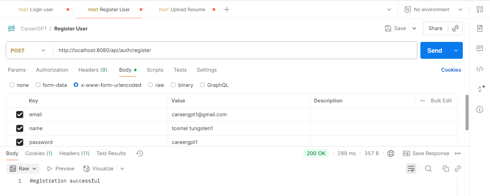
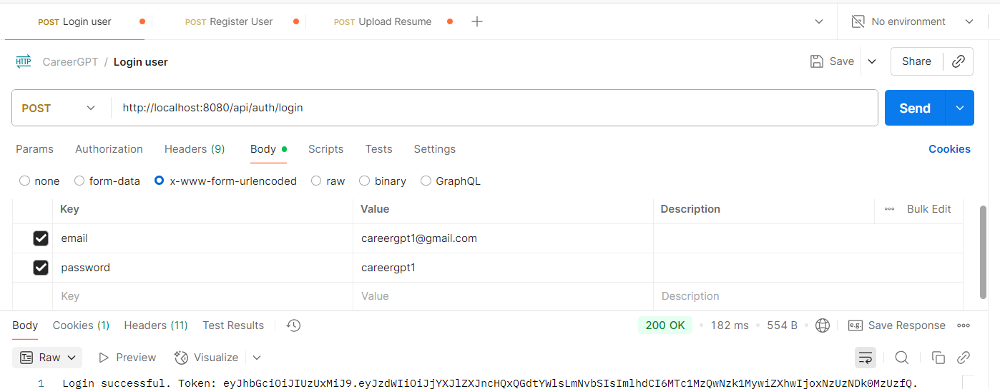
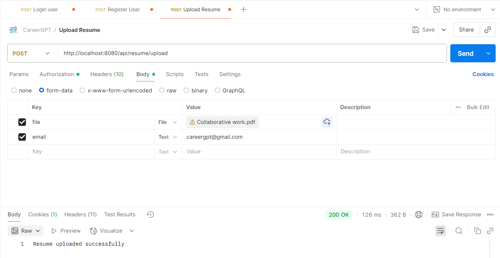
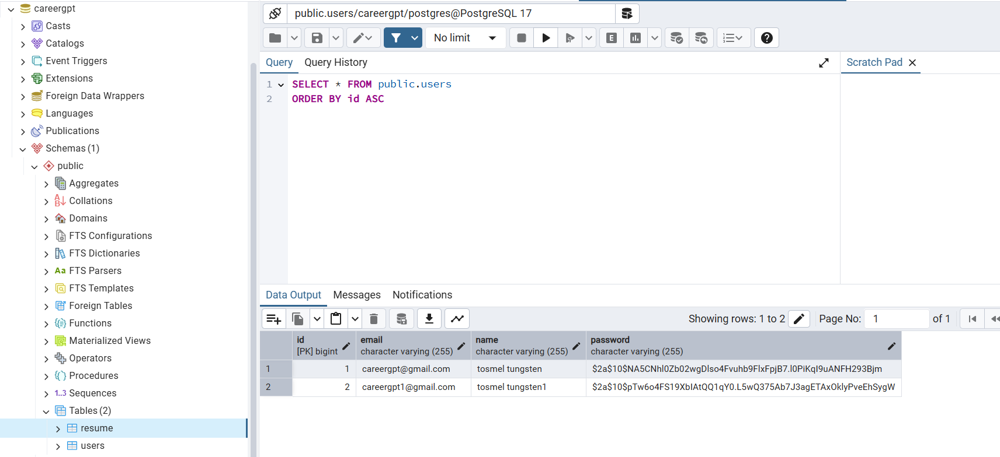
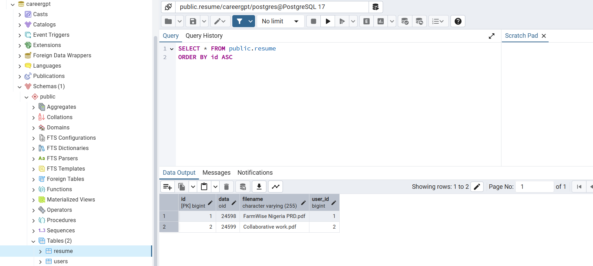
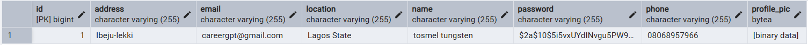
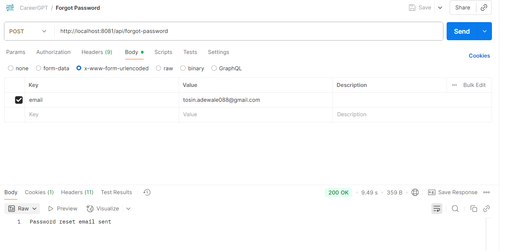
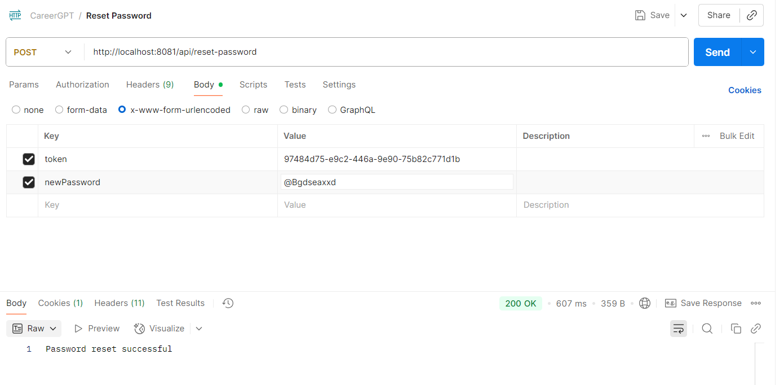
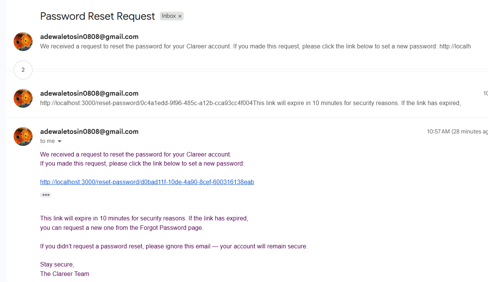

# CareerGPT – AI Career Assistant (Spring Boot)

A web-based AI assistant that analyzes resumes, identifies suitable career paths, and provides personalized job, course, and skill recommendations through a chat interface.

---

## Features

- **User Registration & Login** (JWT authentication)
- **Resume Upload** (PDF, DOCX, etc.)
- (Planned) AI-powered chat for career guidance and recommendations

---

## Tech Stack

- Java 17+
- Spring Boot
- Spring Security (JWT)
- PostgreSQL
- Maven

---

## Getting Started

### 1. Clone the Repository

```bash
git clone https://github.com/MariamAliDEV/CareerGPT.git
cd careergpt
```

### 2. Configure the Database

- Ensure PostgreSQL is running.
- Create a database (e.g., `careergpt`).
- Update `src/main/resources/application.properties`:

    ```properties
    spring.datasource.url=jdbc:postgresql://localhost:5432/careergpt
    spring.datasource.username=your_db_user
    spring.datasource.password=your_db_password

    jwt.secret=your_base64_encoded_secret_key
    jwt.expiration=86400000
    ```

### 3. Build the Project

```bash
mvn clean install
```

### 4. Run the Application

```bash
mvn spring-boot:run
```
or
```bash
java -jar target/com.careergpt-0.0.1-SNAPSHOT.jar
```

The API will be available at [http://localhost:8080](http://localhost:8080)

---
## API Endpoints

| Method | Endpoint                     | Description                |
|--------|------------------------------|----------------------------|
| POST   | api/auth/register            | Register User              |
| POST   | /api/auth/login              | Login User                 |
| PUT    | api/user/update              | Update Users Profile       |
| POST   | /api/resume/upload           | Upload Resume              |
| POST   | /api/user/profile-pic        | Upload Profile Picture     |
| POST   | /api/user/change-password    | Change Password            |
| POST   | /api/forgot-password         | Forgot Password            |
| POST   | /api/reset-password          | Reset Password            |


### Features
1. Implement user registration and login with JWT.












Note; Others will be added via documentation

### **Authentication**

- **Register:**  
  `POST /api/auth/register`  
  Body (x-www-form-urlencoded):  
  - `name`
  - `email`
  - `password`

- **Login:**  
  `POST /api/auth/login`  
  Body (x-www-form-urlencoded):  
  - `email`
  - `password`  
  Returns: JWT token

### **Resume Upload**

- **Upload Resume:**  
  `POST /api/resume/upload`  
  Body (form-data):  
  - `file` (File)
  - `email` (Text)  
  **Requires JWT token in `Authorization: Bearer <token>` header**

---

## Testing with Postman

1. **Register** a user.
2. **Login** to get a JWT token.
3. For protected endpoints (like resume upload), add the JWT token to the `Authorization` header:
    ```
    Authorization: Bearer <your-jwt-token>
    ```
4. Use `form-data` for file uploads.

---

## Development Notes

- Tables are auto-created based on JPA entities.
- Change the default port by adding `server.port=8000` to `application.properties` if needed.
- For production, always protect sensitive endpoints with JWT.
---

## Author
Tosin Adewale


==================
### Testing

PUT /api/user/update (form-data or x-www-form-urlencoded)
POST /api/user/change-password
POST /api/user/profile-pic (form-data: file as File, email as Text)
